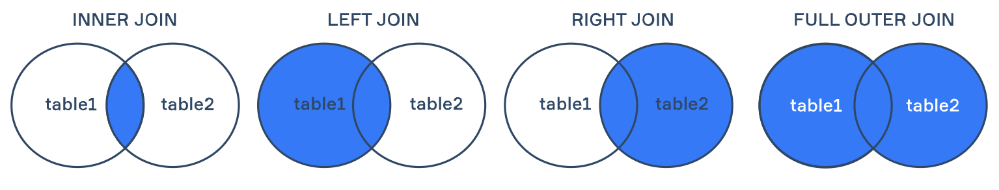

# Quering Databases with SQL
A databases is a collection of organised data stored on a computer for easy search and retrieval operations. A database management system is a type of software that allows users to interact with the data. There are numerous types of DBMS but the two most popular types are Relational DBMS and NoSQL DBMS.

Topics discussed:
1. [**What is SQL?**](#a-little-on-sql)
2. [**Filtering Data**](#filtering-data-with-where)
3. [**Sort the Data**](#more-filtering-and-sorting)
4. [**Joining tables**](#queries-with-join)


## A Little on SQL
**Structured Query Language** (SQL) is the main programming language used to manipulate, transform, and query data that is stored in a relational database. It was created in 1970 to be similar to natural languages. SQL focuses on telling the system the *what* but not the *how*.

There are several basic data types that can be used in SQL:
- **Interger**: represents numbers from -2147483648 to +2147483648.
- **Decimal**: DECIMAL(precision, scale), where precision is the whole digit and scale is the number of units after the decimal point.
- **Float**: has an approximate part from 1-53
- **Boolean**: TRUE or FALSE
- **VARCHAR(n)**: String or text types that cannot be more than n characters long.

In SQL strings can be written in single or double quotes. Numbers can be explicitly defined with the *- or +* signs precedding them; however, the default (no symbol) would be positive. Values can also be **type-cast** using the **CAST()** operator:
```sql
CAST(value as DECIMAL());
CAST(4.5 as DECIMAL(2, 2));
```

## Filtering Data with WHERE
The **WHERE** clause is applied to each row to determine if the data of the row satisfies the conditions. A basic look at how it is used:
```sql
SELECT column, another_column
FROM mytable
WHERE condition
    AND/OR another condition;
```
Complex conditions can be created by using additional WHERE operators that are joined by the logical AND or OR operators:
|Operator     | Use Description               | Example        |
|:-----------:|:------------------------------|:--------------:|
|`=, !=, <, <=, >, >=`| Common numerical operations| `digit < 5`|
|`BETWEEN...AND`| Number is between specified values. BETWEEN is an *inclusive* (range values are included) operator as it can check strings, numbers, and dates|`col_name BETWEEN 4 AND 7`|
|`NOT BETWEEN AND`| Number is not in the range of values|`col_name NOT BETWEEN 8 AND 14`|
|`IN/NOT IN`| Number exists or does exists in a specified list| `price IN(9, 12,17)`|
|`LIKE/NOT LIKE` | used for pattern matching strings| `product LIKE %a%`|
|`EXISTS`| creates a subquery to check if any rows are returned| `EXISTS(query)`|
|`ANY`| used after common operators like = in the Where statement and returns true if the subquery is satisifed| `WHERE id = ANY(query)` |
|`IS NULL/IS NOT NULL| checks if vales are null| `WHERE city IS NOT NULL`|
|`IS/NOT DISTINCT FROM`| returns True only if two values are different| `WHERE place IS DISTINCT FROM 'Paris' `|

When checking for string values always use single quotes. The *<>* can also be used for string inequality. **LIKE** uses special syntax for pattern matching:
- `%`: used anywhere in a string to match a sequence of zero or more characters - *product LIKE %s% can return cash, blissard
- `_`: used anywhere to match a single character - text LIKE s_ (so)

An example with using the **EXIST** clause:
```sql
SELECT *
FROM orders
WHERE EXISTS (
  SELECT 1
  FROM order_items
  WHERE order_items.order_id = orders.order_id
);
```


## More Filtering and Sorting
The **DISTINCT** clause can be used with different SQL statements to discard duplicated values.
```sql
SELECT DISTINCT column
From mytable;
```
The **ORDER BY** clause allows the data to be sorted in ascending or descending order by a specific column. That is, the values of all the tables are arranged based on the ordering of the specific column.
```sql
SELECT column1, column2 
FROM Soccer 
ORDER BY player ASC/DESC;
```
The **LIMIT** clause is used to restrict the number rows and the **OFFSET** clause specifies where to start the limiting. They are generally placed last in a query.
```sql
SELECT column1, column2 
FROM Soccer 
ORDER BY player ASC/DESC
LIMIT 6 OFFSET 13;
```

## Queries with JOIN
**JOIN** is used to combine rows of data about an entity across two different tables. The **INNER** JOIN is the same as using JOIN alone. It only return matching column of a table. That is, if there is a column of the same name in both tables it will return data based on that column.The **ON** keyword is used to specifed what column to match on.
```sql
SELECT movies.title, boxoffice.rating 
FROM movies
INNER JOIN boxoffice
    ON movies.id = boxoffice.movie_id
ORDER BY boxoffice.rating DESC;
``` 
Other types of JOINS:
- **RIGHT/LEFT**: returns all records from the right/left and only the matching columns of the other
- **FULL/OUTTER**: returns both tables if there is a match
- **CROSS**: combines every record on the left with every record on the right.

Visual Representation

Source: [HyperSkill](https://hyperskill.org/learn/step/12100#inner-join)
The joins only return the records that match, not necessarily the full table, mainly column.
