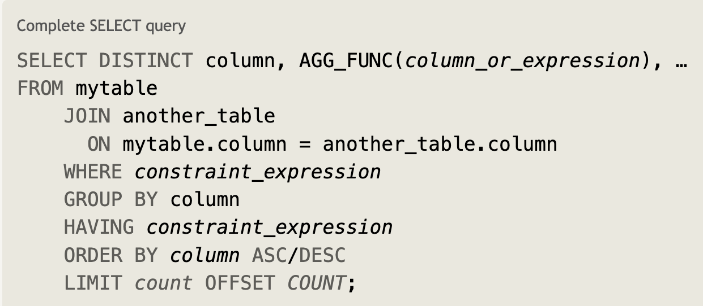

# Quering Databases with SQL

Topics discussed:
1. [**What is SQL?**](#a-little-on-sql)
2. [**Filtering Data**](#filtering-data-with-where)
3. [**Sort the Data**](#more-filtering-and-sorting)
4. [**Joining tables**](#queries-with-join)
5. [**How to Modify Data?**](#data-modification-language)
6. [**Performing Operations**](#functions-and-operations-in-sql)
7. [**Working with Date and Time**](#date-and-time-in-sql)

**PostgreSQL** is free and open-source. It was created by the University of California, Berkeley.

## A Little on SQL
**Structured Query Language** (SQL) is the main programming language used to manipulate, transform, and query data that is stored in a relational database. It was created in 1970 to be similar to natural languages. SQL focuses on telling the system the *what* but not the *how*.

Comments are written as:
```sql
-- This is a single line comment
/* This expands
multiple lines
*/
```
Like any other language SQL has a coding style:
- **Names** should be written in snake_case and be meaningful.
- **Spaces and Lines**: for long queries use indents and place logical operators (AND and OR) on a new line.
- Write keywords in CAPS.

|Variable Type | Description                        |
|:-------------|:-----------------------------------|
|User-defined | Can be created using SELECT or SET statements with the assignment operator. When perform calculation use the SELECT with :=. Example SELECT @score = AVG(hits) FROM basketball. |
|Local | Cannot be used everywhere and needs to be declared before it can be used. DECLARE location VARCHAR (DEFAULT) is optional. The @ sign is not needed. Then the SET or SELECT keywords can be used. SET location = 'Chicago' |
|System | Automatically created by the DBMS. Use SHOW VARIABLES with the optional parameters Global and Local. To use them use SELECT @@ |


There are several basic data types that can be used in SQL:
- **Interger**: represents numbers from -2147483648 to +2147483648.
- **Decimal**: DECIMAL(precision, scale), where precision is the whole digit and scale is the number of units after the decimal point.
- **Float**: has an approximate part from 1-53
- **Boolean**: TRUE or FALSE
- **VARCHAR(n)**: String or text types that cannot be more than n characters long.

In SQL strings can be written in single or double quotes. Numbers can be explicitly defined with the *- or +* signs precedding them; however, the default (no symbol) would be positive. Values can also be **type-cast** using the **CAST()** operator:
```sql
CAST(value as DECIMAL());
CAST(4.5 as DECIMAL(2, 2));
```
### Views
Views are a re-usable mechanism used for querying data from a database or table. It is the virtual table of a  saved result of a SELECT statement. It has the syntax:
```sql
CREATE [OR REPLACE]
[ALGORITHM = {UNDEFINED | MERGE | TEMPTABLE}]
VIEW view_name AS
SELECT 
    column1, 
    column2, 
    ...
FROM 
    table_name
WHERE 
    condition;
```

Once the view is created, it can be queried from.

### Optimisation
You can create a temporary table using the clause CREATE TEMPORARY TABLE which will only be viewable for the current session. DENSE_RANK() do not leave gaps in the rows. NTILE(n) splits groups. ROW_NUMBER().

The EXPLAIN keyword used with the FORMAT=tree displays the execution steps of a query. The EXPLAIN ANALYZE is used to compare predictive data with actual data. USE INDEX forces an index for a variable.

## Filtering Data with WHERE
The **WHERE** clause is applied to each row to determine if the data of the row satisfies the conditions. A basic look at how it is used:
```sql
SELECT column, another_column
FROM mytable
WHERE condition
    AND/OR another condition;
```
Complex conditions can be created by using additional WHERE operators that are joined by the logical AND or OR operators:
|Operator     | Use Description               | Example        |
|:-----------:|:------------------------------|:--------------:|
|`=, !=, <, <=, >, >=`| Common numerical operations| `digit < 5`|
|`BETWEEN...AND`| Number is between specified values. BETWEEN is an *inclusive* (range values are included) operator as it can check strings, numbers, and dates|`col_name BETWEEN 4 AND 7`|
|`NOT BETWEEN AND`| Number is not in the range of values|`col_name NOT BETWEEN 8 AND 14`|
|`IN/NOT IN`| Number exists or does exists in a specified list| `price IN(9, 12,17)`|
|`LIKE/NOT LIKE` | used for pattern matching strings| `product LIKE %a%`|
|`EXISTS`| creates a subquery to check if any rows are returned| `EXISTS(query)`|
|`ANY`| used after common operators like = in the Where statement and returns true if the subquery is satisifed| `WHERE id = ANY(query)` |
|`IS NULL/IS NOT NULL| checks if vales are null| `WHERE city IS NOT NULL`|
|`IS/NOT DISTINCT FROM`| returns True only if two values are different| `WHERE place IS DISTINCT FROM 'Paris' `|

When checking for string values always use single quotes. The *<>* can also be used for string inequality. **LIKE** uses special syntax for pattern matching:
- `%`: used anywhere in a string to match a sequence of zero or more characters - *product LIKE %s% can return cash, blissard
- `_`: used anywhere to match a single character - text LIKE s_ (so)

An example with using the **EXIST** clause:
```sql
SELECT *
FROM orders
WHERE EXISTS (
  SELECT 1
  FROM order_items
  WHERE order_items.order_id = orders.order_id
);
```
NULL values can be replaced with default datatype specific values. A great way to test for NULL values is to extract them using the WHERE clause.


## More Filtering and Sorting
The **DISTINCT** clause can be used with different SQL statements to discard duplicated values.
```sql
SELECT DISTINCT column
From mytable;
```
The **ORDER BY** clause allows the data to be sorted in ascending or descending order by a specific column. That is, the values of all the tables are arranged based on the ordering of the specific column.
```sql
SELECT column1, column2 
FROM Soccer 
ORDER BY player ASC/DESC;
```
The **LIMIT** clause is used to restrict the number rows and the **OFFSET** clause specifies where to start the limiting. They are generally placed last in a query. The OFFSET can be the first argument to the LIMIT 10, 5. Other DBs may use FETCH FIRST or TOP(n) after SELECT in SQL server.
```sql
SELECT column1, column2 
FROM Soccer 
ORDER BY player ASC/DESC
LIMIT 6 OFFSET 13;
```

The **CUBE** clause is used with the GROUP BY to include all possible combination for aggregation, including the sum of all totals. **ROLL UP** generates an aggregated result for the specified columns in a hierachy and not totals. GROUPING SET (revisit this topic)

### Using the WITH clause
The **WITH** clause is known as a **Common Table Expression** (CTE) for refactoring long and complex queries. The output is not permanent but can be referenced in the query. The temporary results can be used inside the scope of the SELECT, DELETE, UPDATE, INSERT, and MERGE statements. Example:
```sql
WITH cte_total_value AS (  -- temporary table
    SELECT 
        product_name,
        quantity,
        price,
        price * quantity AS total_value
    FROM inventory
)
-- Use the temporary table
SELECT *
FROM cte_total_value
ORDER BY total_value DESC;
```
It is similiar to a subquery, with the exception that it can be recursive and be re-used.
2233444
2233334444

## Queries with JOIN
**JOIN** is used to combine rows of data about an entity across two different tables. The **INNER** JOIN is the same as using JOIN alone. It only return matching column of a table. That is, if there is a column of the same name in both tables it will return data based on that column.The **ON** keyword is used to specifed what column to match on.
```sql
SELECT movies.title, boxoffice.rating 
FROM movies
INNER JOIN boxoffice
    ON movies.id = boxoffice.movie_id
ORDER BY boxoffice.rating DESC;
``` 
Other types of JOINS:
- **RIGHT/LEFT**: returns all records from the right/left and only the matching columns of the other
- **FULL/OUTTER**: returns both tables if there is a match
- **CROSS**: combines every record on the left with every record on the right.

Visual Representation

Source: [HyperSkill](https://hyperskill.org/learn/step/12100#inner-join)

The joins only return the records that match, not necessarily the full table, mainly column.

## Data Modification Language
The **INSERT** statement provides a way to add values to a table. It specifies the table, the column names, and the values to be placed. The number of values should correspond to the number of columns, and multiple values (tuples) should be separated by a comma. Not all columns need to be specified, such as auto-incrementing ids (primary-key).
```sql
INSERT INTO sports
(name, years, number_players)  -- Column Names
-- Values to be inserted
VALUES ("football", 98, 35),
    ("basketball", 56, 75)
```

The UPDATE clause changes the data of an entity in the table. It works with the SET and WHERE clauses, where the SET specifies the column and adds the values and the WHERE ensures it is added to the right entity by using a column value to specify.
``` sql
UPDATE food
SET price = 5
WHERE id = 3;
```
The DELETE clause uses the FROM clause to specify what table to delete from. The WHERE clause adds the condition which selects the correct row (entity) to remove.
```sql
DELETE FROM <TableName> WHERE <condition>
```

A new table can be created by specifying the column names, data types, an optional constraint, and an optional default value. The **IF NOT EXISTS** clause can be added to only add the table if it is not in the database already. The CREATE clause can also be used to create a new database.
```sql
CREATE TABLE IF NOT EXISTS houses (
	house_id INT PRIMARY KEY AUTO_INCREMENT,
	type TEXT,
	manager TEXT,
	price FLOAT,
	year_listed INT  --can also use INTEGER
);
```
Other constraints include NOT NULL, FOREIGN KEY, UNIQUE CHECK (can add a calculation), DEFAULT.

The ALTER statement is used to add and modify(rename and delete) columns of a table. 
```sql
-- Adding columns to the table
ALTER TABLE nobel_prizes
ADD degree_type VARCHAR(50)  --Optional Constraint
	DEFAULT None;

-- Deleting a column
ALTER TABLE languages
DROP modify_date  -- can also be used to delete a DB

-- Rename the table
ALTER TABLE nobel_prizes
RENAME TO nobel_winners
```
Constraints with Alter
```sql
ALTER TABLE employees
ALTER first_name SET DEFAULT 'John';
```

**DROP TABLE** can be used to remove a table. However, ensure that tables with foreign key that depend on the table is taken care of before removing. Also check if the table exists by using **DROP TABLE IF EXISTS**.

Information (entities) can be copied from one table to the next by combining the INSERT TO and SELECT clauses.
```sql
INSERT INTO foods (food_type, cost, origin)
SELECT * FROM groceries;
```
The data can be filtered by using a WHERE clause.
```sql
INSERT INTO managers (name, surname, manager_email)
SELECT name, surname, seller_email
FROM sellers
WHERE name = 'John' AND surname = 'Marley';
```

**Sequences** are objects that are used to generic unique numeric values such as *primary key* values. In MySQL it can be done by using the **AUTO_INCREMENT** clause when creating a table. Restrictions:
- Only one column in a table can use it
- The column should be of the Interger type
- A NOT NULL contraint will be automatically added in MySQL if not specified.

However, to change the starting point of the clause use the ALTER TABLE clause:
```sql
/* Works as there can only be ONE AUTO_INCREMENT
in a table (column) */
ALTER TABLE sports AUTO_INCREMENT = 10
```

## Functions and Operations in SQL
Expressions can be used on column values to extract specific data in the SELECT clause. These can be simple aithmetic operations, functions, data operations, or string manipulation. When using SELECT with strings that have multiple values use double quotes (*"brand identity"*).
 The **AS** keyword makes it easy to provide aliases for the data that shows the result of an operation. 
 ```sql
 SELECT price / 2 AS half_price
 ```

 ### Aggregate Functions
 Aggregate expressions of functions are used to summarise a group of data, but performing calculations on a set of values and returning a single value.
 Common aggregate functions:
 - **COUNT(*)/COUNT(col_name)**: Counts the total number of records including NULL values/Counts the records in a specified column and exclude NULL records.
 - **MIN/MAX(col_nam)**: Finds the smallest or largest value in a column. Can also be used on strings.
 - **AVG(col_nam)**: Returns the mean of the values.
 - **SUM(col_nam)**: Calculates the total numerical values.

The GROUP BY clause is handy to use with aggregate functions. It categorises data with similar values based on specific columns, which allows the aggregate expressions to be performed on them. That is, calculations can be performed on the different types of values in a specific column and not just the entire column. 
```sql
SELECT product_category, SUM(sales_amount) AS total_sales
FROM sales_data
GROUP BY product_category; 
```

The HAVING clause works just like the WHERE but is to be used on the data that is specified by the GROUP BY clause when it is used after the WHERE clause. It canl also be used in subqueries instead of the WHERE clause and works well will common functions such as AVG.

Other useful functions in SQL:
- **PERCENTILE_CONT(n)/PERCENTILE_DIST()**: calculates the median
- **STDEV()**: standard deviation

### Common String Operations in SQL (MySQL)
1. concat(): Joins two or more string values together
	- SELECT concate(firstName, ' ', lastName) AS full_name
2. char_length(): return the length of a string.
3. subtr(string, start, amount)
4. replace(string, oldvalue, newvalue): doesn't modify the database, just displays in the result
5. reverse(string)

```sql
-- String operations can be combined
SELECT
	concat(substr(first_name, 1, 1), '.', last_name)
FROM singers;
```

### Conditional Function in SQL
The **CASE** clause is similiar to the if-else statement of common programming languages for performing conditional logic. It can take multiple **WHEN - THEN** clauses and create columns based on logic.
```sql
SELECT name, gender
	CASE city  -- similar to switch (optional)
		WHEN 'Atlanta' THEN 'Georgia'
		WHEN 'LA' THEN 'California'
		ELSE 'No State'
	END AS state
FROM people;
```
The **COALESCE()** function returns the first NON NULL value in a list or column. It can be used to replace NULL values with anything specified. Example COALESCE(streets, 'does not exist'); NULL values would be replaced with 'does not exist' in a column.

### Window Functions
They allow for the calculations of data across rows that are related to the current row. They are used so there would be no need to group results. The **OVER()** clause defines the window of rows to perform the calulation on. Components:
- **PARTITION BY**: divide the result into components to which the window function is applied
- **ORDER BY**: defines the sequence in which the function is applied.

Common Window Functions:
1. **SUM()**: calculates the running total
2. **AVG()**: calculates the average
3. **RANK()**: assigns a rank to each row within a partition with gaps for ties
4. **ROW_NUMBER()**: provides a unique number to each rows in a partition.

Common window frame combinations
- ROWS BETWEEN UNBOUNDED PRECEDING AND CURRENT ROW:
	-Includes all rows from the start of the partition up to the current row. Useful for cumulative sums.
- ROWS BETWEEN CURRENT ROW AND UNBOUNDED FOLLOWING:
	- Includes the current row and all rows following it to the end of the partition.
- ROWS BETWEEN UNBOUNDED PRECEDING AND UNBOUNDED FOLLOWING:
	- Includes all rows in the partition. This is the default if no frame is specified.
- ROWS BETWEEN n PRECEDING AND n FOLLOWING:
	- Includes a specific number of rows before and after the current row, creating a moving window of fixed size.


### Query Order of Operations
Place in the position of execution
1. **FROM** and **JOINS**: includes there subqueries.
2. **WHERE**: conditions are applied to the rows from the tables specified from the FROM and JOIN statements.
3. **GROUPBY**: records resulting from the WHERE are grouped.
4. **HAVING**: adds additional queries to the records extracted by the GROUP BY clause.
5. **SELECT**: expressions in the select are computed.
6. **DISTINCT**: rows that doesn't satisfy this will be discarded.
7. **ORDER BY**: rows are then sorted.
8. **LIMIT/OFFSET**.

Visual Representation of the order of a query:


Source: [sqlbolt](https://sqlbolt.com/lesson/select_queries_order_of_execution)

### Set Operations
Set operations can be used to combine the results of multiple SELECT statements. They require that all the SELECT statements have:
- The same number of columns.
- All the coumns have the same datatype.
- Columns are selected in the same order.

Types of set operators
| Set Operator    | Description/Use                   |
|:---------------:|:----------------------------------|
|`UNION` | merges the results of two or more SELECT statements, and removes duplicates |
|`UNION ALL`| includes duplicates |
|`INTERSECT` | returns the rows that are present both statements |
|`EXCEPT/MINUS` | retursn the rows of the first set that are not in the second set |

Example of the INTERSECT operator which will only choose names that are present in both sets:
```sql
SELECT name FROM class
INTERSECT
SELECT name from sport
```

## Subqueries
Statement like *SELECT, UPDATE, DELETE, INSERT* can use subqueries. The outer query is the main query and the inner query can use values from it.
```sql
SELECT *
FROM persons
WHERE age = (
    SELECT MAX(age)
    FROM persons
);
```
Using the INSERT clause with two different databases and subqueries.
```sql
INSERT INTO books
    (title, category)
VALUES (
    'Grokking Deep Learning',
    (SELECT category FROM rented_books WHERE category = 'Grokking Algorithms')
);
```

## Date and Time in SQL
Common date and time types in SQL, mainly applicable to MySQL:
- **DATE**: stores the date in the format year:month:day (2023:12:08), without the time.
- **TIME**: stores the time in hh:mm:ss.
- **DATETIME/TIMESTAMP**: combines the date and time. Timestamp is limited to '1970-01-01 00:00:01' UTC to '2038-01-19 03:14:07' UTC.
- **INTERVAL**: used to store the differences:
	- **INTERVAL YEAR TO MONTH**
	- **INTERVAL DAY TO SECOND**: differences in days, hours, minutes, and seconds.

To get the current date and time use the *CURDATE(), CURTIME() or CURRENT_DATE(), CURRENT_TIME()* functions. If both the time and date is needed use **CURRENT_TIMESTAMP()**.
```sql
SELECT CURRENT_TIMESTAAMP();
```

To get the difference in dates use the **DATEDIFF(first, second)** function. For the difference in time use **TIMEDIFF(first, second)**.
```sql
SELECT DATEDIFF('2020-05-15 09:34:34', '2020-05-10 15:34:43');
```
Use the EXTRACT() method to get a specific piece of a date.
```sql
SELECT EXTRACT(DAY FROM '2023:11:7 17:45:10');
```
Dates can be added and substracted. There are two methods that can be used to add.
```sql
-- add a month
SELECT DATE_ADD(CURDATE(), INTERVAL 4 MONTH);
-- add days
SELECT ADDDATE(CURDATE(), 10);
-- substract years
SELECT DATE_SUB(CURDATE(), INTERVAL 3 YEAR);
```
Timezones can be converted with the syntax: COVERT_TZ(time, from_zone, to_zone).
```sql
SELECT CONVERT_TZ('2024:11:8 13:56:44', 'US/Central', 'UTC');
```

## Primary and Foreign Keys
The foreign key is also called the reference key that can be used to reference data from another table. The **REFERENCE** key contain the the table and its primary key column to which the foreign key is referencing.
There several things that the database can do if specified when creating the table with the foreign key. These actions make it easier to change the date based on the action of the primary table using ON UPDATE and ON DELETE.
- *SET NULL*: changes the values corresponding to the key to NULL
- *CASCADE*: automatically delete or update the rows.
- *RESTRICT*: the operation in the parent table will be rejected.
- *SET DEFAULT*: the table with the foreign key would be set to default values.
- *NO ACTION*.

```sql
CREATE TABLE mistakes (
	id INT PRIMARY KEY,
	date DATE,
	name VARCHAR(50),
	location_id INT,
	CONSTRAINT location_db FOREIGN KEY (location_id),
	REFERENCES locations(loc_id),
	ON DELETE CASCADE,
	ON UPDATE CASCADE
);
```

To add a foreign key to an existing table use the ALTER TABLE ADD syntax with the REFERENCE to the parent table. If there is a need to add an existing foreign key to multiple columns use:
```sql
ALTER TABLE clubs
ADD CONSTRAINT persons_db FOREIGN KEY (person_id)
REFERENCES persons(person_id)
```
The ALTER DROP FOREIGN KEY clause is used to delete a foreign key. If the foreign key is unknown use the SHOW CREATE TABLE tableName to get it.


COALESCE()?
## Resources
- [sqlbolt](https://sqlbolt.com/)
